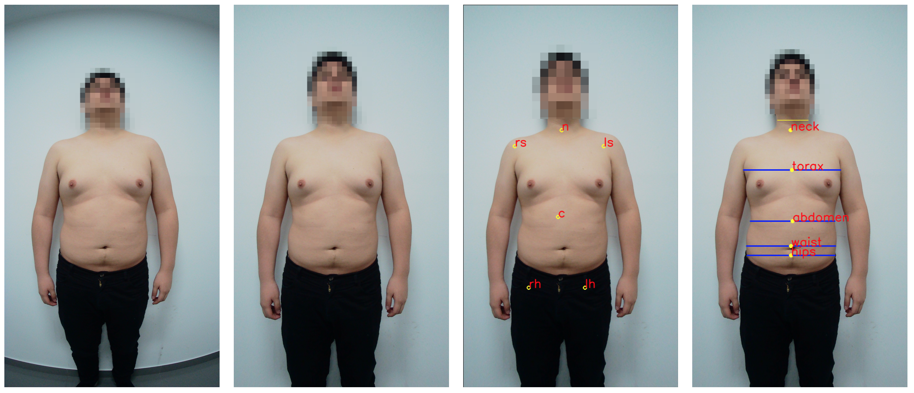
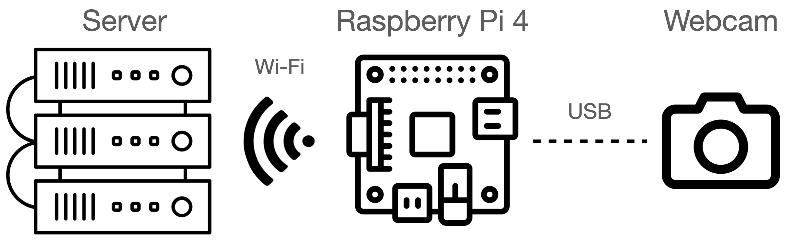
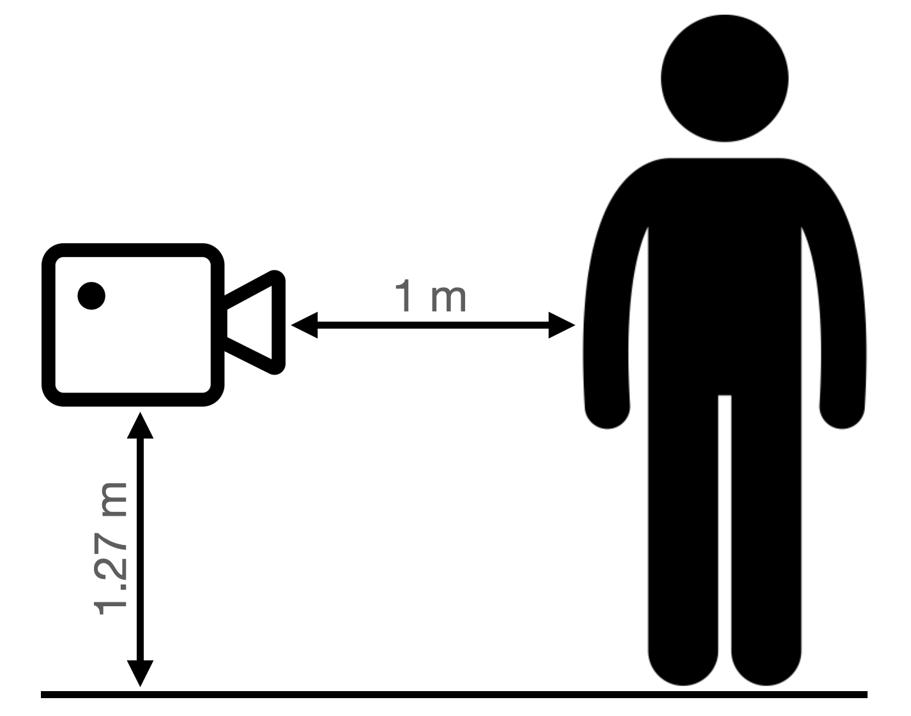
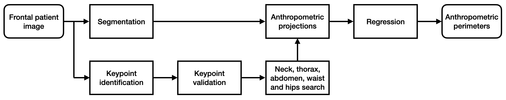
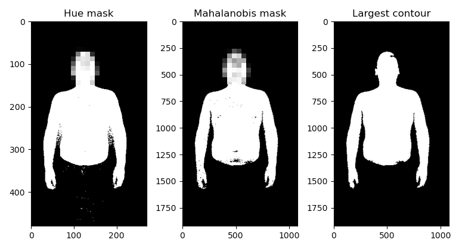
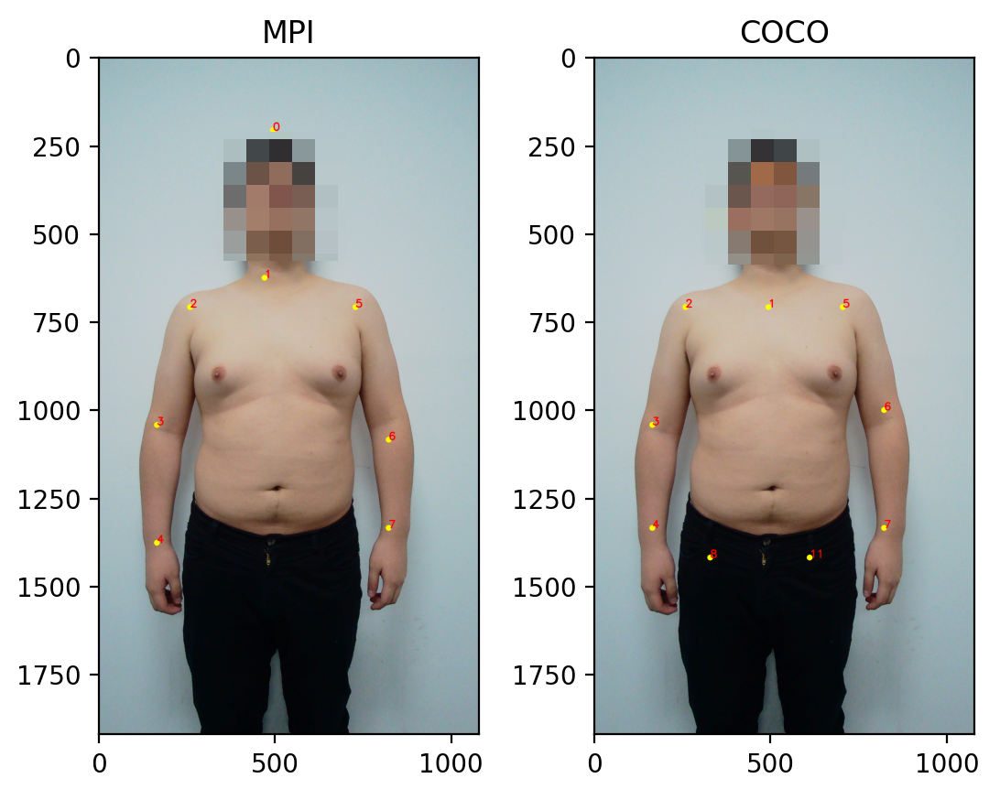
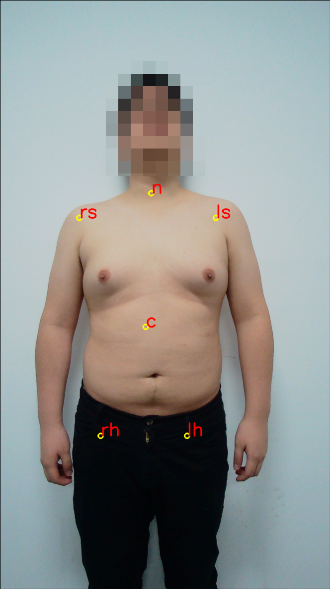
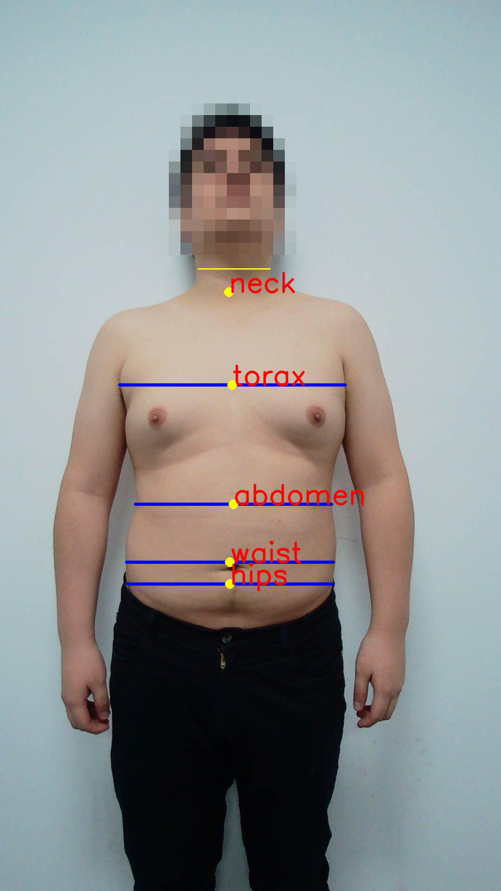

# Anthropometric Measurement Estimation using OpenPose Algorithm

**Anthropometric measurement estimation algorithm:** From left to right--original image of patient; undistorted image; keypoint estimation using OpenPose; anthropometric measurements (projections). 
 

 

This repository contains the code for an anthropometric measurement estimation algorithm using the OpenPose model developed by CMU Perceptual Computing Lab. The algorithm estimates the neck, thorax, abdomen and waist measurement projections of male patients using single frontal images. Future work will focus on developing regression models to estimate the circunference of the selected areas based on the frontal projections. The circunferences, and even the projections, can be used by medical doctors in occupational health clinics to evaluate the patient's capability on performing certain jobs.

## Description

### 1. Hardware

The anthropometric measurement system consists of a camera that acquires images with a resolution of 1280x720 pixels, a Raspberry Pi 4, used to acquire the images, and a remote server that processes the images and estimates the measurements. The code in this repository runs on the remote server.

### 2. Image acquisition protocol

An image acquisition protocol is used to standardize all images. The camera is located at a distance of 1.27 meters from the ground and perpendicularly at a distance of 1 meter from the patient. The patient must remove his shirt and extend his arms at an angle of 45 degrees with respect to the torso. The acquisition system then acquires a frontal image of the patient.

### 3. Algorithm

The algorithm estimates five anthropometric measurements: (1) neck, (2) thorax, (3) abdomen, (4) waist and (5) hips. In order to accomplish this, the algorithm uses six stages:

#### 3.1. Image segmentation

The patient's body is segmented using color thresholding in the HSV color space. Then, the mahalanobis distance is used to isolate the patient's color skin, eliminating the background and creating a binary mask. The mask is then refined by applying morphology operations.

#### 3.2. Keypoint identification

The algorithm identifies the patients, keypoints using MCU Perceptual Computing Lab's OpenPose model. This algorithm uses convolutional neural networks (CNNs) to identify and localize several parts of the body in color images. The OpenPose model first generates feature maps using a VGG-19 network. Then, the feature maps are used as input to a second CNN, which generates part affinity maps. Lastly, a third CNN is used to produce probability maps for each body part.

#### 3.3. Keypoint validation

The OpenPose model is trained on two datasets: MPII and COCO. In this project we use both in order to improve the keypoint detection accuracy of the algorithm. For example, if one of the model trained with one dataset is not able to identify one of the body parts, the other one can be used as a substitute.

#### 3.4. Neck, thorax, abdomen, waist and hips search

The neck, thorax, abdomen, wait and hip keypoints are computed from other keypoints found by the OpenPose model. The formulas and methods for finding these new keypoints are presented in the code.

#### 3.5. Anthropometric projections

Finally, the anthropometric projections are estimated by projecting the neck, thorax, abdomen, waist and hips keypoints horizontally in the binary mask until a sudden change in pixel intensity is found. The two pixel locations where the intensity change is detected represent the complete length of the anthropometric projection corresponding to one of the keypoints. Additional processing is done in order to correct the measurement in edge cases.

#### 3.6. Future work: Regression

In the future, a regression model could be used to estimate the perimeter of the different body parts from the projections. In order to train the model, more anthropometric data should be acquired, as well as patient images.
